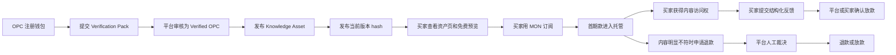

# Final Product Model

## 一句话

OPC KnoVault 是 AI 时代 OPC 的可信知识资产交易层：个人或小团队把可复用知识、模板、方法论和数据包发布成可验证资产，买家用 MON 订阅访问权，Monad 记录资产、版本、订阅、反馈、托管放款和退款裁决。

## 最终取舍

当前有两条产品线索：

- OPC Match：需求方发布机会，AI 匹配 OPC 或 OPC 小队，生成 Intent Proof。
- OPC Trust Market：Verified OPC 发布知识资产，买家订阅，Monad 记录可信交易事件。

最终黑客松版本选择 **OPC Trust Market 作为主产品**。原因是它的交易对象更清楚，付款和权限更容易闭环，评委能在 5 分钟内看懂 Monad 的必要性。

OPC Match 不丢弃，定位为后续的上游发现层：AI 帮需求方找到合适资产或 OPC，小队合作意向可以生成 Intent Proof，但真正可收费、可交割、可留痕的第一交易单元是 Knowledge Asset Subscription。

## 交易对象

v1 只交易 Knowledge Asset，不交易泛技能、不交易招聘岗位、不交易执行型外包。

资产类型固定为三类：

- Document / Report：研究报告、审计报告、行业分析、市场进入报告。
- Template / Methodology：SOP、Playbook、方法论、表格模板、工作流说明。
- Dataset / Annotation Pack：数据集、标注包、评测集、联系人图谱、样本库。

买家买到的是：

- Usage Right：在订阅期内使用资产内容。
- Content Access：访问当前有效版本的正文或文件。
- Update Access：订阅期内访问最新有效版本。
- Purchase Record：订阅记录和资产元数据永久可追溯。

买家没有买到：

- 所有权。
- 转售权。
- 二次分发权。
- 对知识正确性的链上保证。
- 对卖家未来执行服务的 SLA。

## 可交易资产标准

一个资产能上架，必须有六个要素：

1. Clear Promise：一句话说明这个资产帮买家解决什么问题。
2. Preview：免费摘要、目录、样例页或样例数据。
3. Version：当前版本号、版本 URI、版本 hash。
4. Provenance：Verified OPC、钱包地址、作品样本、生产方式披露。
5. Price：MON 计价、订阅周期、首期退款窗口。
6. Reputation：订阅次数、结构化反馈、争议记录。

资产生产方式必须披露：

- Human-authored
- AI-assisted
- Agent-executed

这使 AI 内容不是风险黑箱，而是资产元数据的一部分。

## 交易生命周期

## Monad 记录什么

Monad 不存完整内容，只存可信交易事件。

链上对象：

- OPCVerification：OPC 是否通过审核，验证材料 hash。
- AssetRegistered：资产存在，卖家地址，资产类型，生产方式，价格，订阅周期。
- AssetVersionPublished：版本存在，版本号，版本 hash，版本 URI。
- SubscriptionCreated：买家、卖家、资产 ID、付款金额、访问截止时间、访问承诺 hash。
- FeedbackSubmitted：评分、反馈 hash、反馈 URI。
- FirstTermApproved：首期放款、平台费用、卖家收入。
- SubscriptionDisputed：退款申请和争议材料 hash。
- DisputeResolved：平台裁决，退款或放款结果。

链下保存：

- Markdown / PDF / Dataset 正文。
- 免费预览渲染。
- 作品样本和人工审核材料。
- 完整反馈文本。
- 搜索索引、推荐、排序和声誉聚合。

核心叙事：Monad 是可信交易与声誉事件层，不是内容存储层，也不是普通支付壳。

## 平台收入模型

v1 收入来自交易和准入，不需要复杂代币模型。

- Subscription Fee：每笔订阅抽成，例如 2.5%。
- Verification Fee：OPC 提交 Verification Pack 后，平台收一次审核费。
- Featured Asset：优质资产可购买榜单/搜索曝光。
- Buyer Tools：买家订阅监控、资产更新提醒、采购记录导出。
- Reputation Analytics：面向高频卖家的声誉分析和转化分析。

首版只需要演示 Subscription Fee。合约当前默认部署脚本使用 250 bps，也就是 2.5% 平台费。

## 为什么不是招聘或外包平台

招聘平台交易的是人和雇佣关系。

外包平台交易的是一次性任务和人工交付。

OPC KnoVault 交易的是可复用资产的访问权。它更像：

- 淘宝：资产页、价格、订阅、评价。
- Boss 直聘：供需发现和可信档案。
- 链上履约层：付款、版本、反馈、退款、声誉事件可追溯。

但是 v1 不做招聘、不做简历、不做执行型服务。这样交易边界更清楚，Demo 更容易成交闭环。

## AI Agent 在产品里的位置

AI Agent 不是主交易对象，而是交易辅助层：

- 帮买家把需求翻译成资产搜索条件。
- 解释为什么某个资产匹配需求。
- 总结免费预览和风险提示。
- 生成订阅前的采购摘要 hash。
- 未来把 OPC Match 的机会发布和小队匹配接进来。

Hackathon Demo 可以用规则和预置数据模拟 Agent 推荐，不依赖现场不稳定的实时生成。

## 黑客松最短闭环

评委需要看到一条线：

1. 一个 Verified OPC 发布了 "AI 出海增长审计报告包"。
2. 资产页展示摘要、样例、版本、生产方式、价格和声誉。
3. 买家连接钱包，用 MON 订阅当前版本。
4. 页面展示 Monad trust contract、version hash、subscription record。
5. 买家提交结构化反馈。
6. 平台放款，平台费和卖家收入可解释。

这条闭环证明：个人 OPC 可以把知识资产变成可交易商品，Monad 让交易和声誉具备可验证记录。

## 后续扩展

第一阶段：Knowledge Asset Subscription。

第二阶段：OPC Match。买家发布机会，Agent 匹配资产、OPC 和小队，生成 Intent Proof。

第三阶段：Asset License。知识库、数据集、Agent workflow 支持更细粒度授权。

第四阶段：Team Deal。多个 OPC 组成临时小队，按份额分账和积累协作声誉。

第五阶段：Agent Service。把执行型 Agent 服务接入里程碑、验收和自动化交付。
